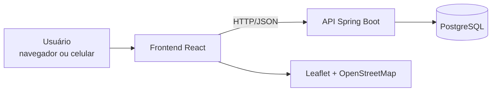

# Código do Projeto

Este diretório contém todo o código-fonte do Reciclaki, dividido em duas aplicações:

| Pasta | Tecnologia | Descrição |
|-------|------------|-----------|
| [`backend/`](backend/README.md) | Java 17 + Spring Boot | API REST, regras de negócio, autenticação e persistência |
| [`frontend/`](frontend/README.md) | React + Vite | Interface web responsiva consumida pelos usuários |

## Arquitetura



## Como executar localmente

### Pré-requisitos

* [Node.js 18+](https://nodejs.org/) e npm
* [Java JDK 17+](https://adoptium.net/)
* [Maven 3.9+](https://maven.apache.org/) ou o Maven Wrapper (`mvnw`) incluso no projeto
* [PostgreSQL 15+](https://www.postgresql.org/) (opcional: em desenvolvimento é usado o banco H2 em memória)

### 1. Backend

```bash
cd codigo/backend
./mvnw spring-boot:run
```

No Windows, use `mvnw.cmd spring-boot:run`.

* API: `http://localhost:8080/api`
* Documentação Swagger: `http://localhost:8080/swagger-ui.html`

### 2. Frontend

```bash
cd codigo/frontend
npm install
npm run dev
```

Crie o arquivo `codigo/frontend/.env` com o endereço da API:

```bash
VITE_API_URL=http://localhost:8080/api
```

* Aplicação: `http://localhost:5173`
