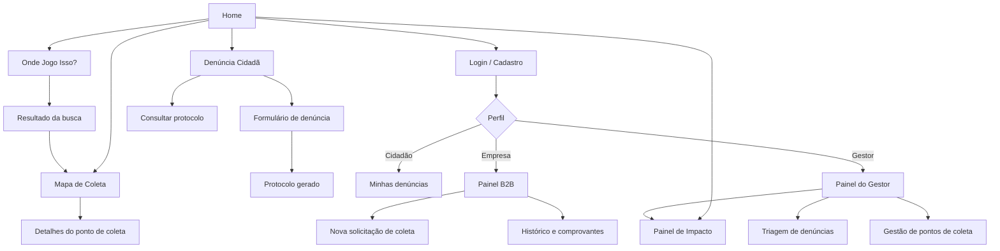

[⬅ Voltar ao índice](../README.md)

# Product Design

Nesse momento, vamos transformar os insights e validações obtidos em soluções tangíveis e utilizáveis. Essa fase envolve a definição de uma proposta de valor, detalhando a prioridade de cada ideia e a consequente criação de wireframes, mockups e protótipos de alta fidelidade, que detalham a interface e a experiência do usuário.

## Proposta de Valor

##### Proposta para a Persona Mariana Souza (Cidadão)

| Mapa de valor | | Perfil do cliente | |
|---|---|---|---|
| **Produtos e serviços** | Diretório "Onde Jogo Isso?", Mapa de Coleta, Denúncia Cidadã | **Tarefas** | Separar e descartar resíduos; encontrar pontos de coleta; reclamar de lixo acumulado |
| **Criadores de ganho** | Resposta em segundos sobre como descartar; pontos mais próximos no mapa; protocolo para acompanhar a denúncia | **Ganhos** | Segurança de estar descartando certo; bairro mais limpo; sensação de contribuir |
| **Aliviadores de dor** | Conteúdo confiável e em linguagem simples; seção "Mitos e Verdades"; denúncia com foto em poucos passos | **Dores** | Informação contraditória; não saber onde descartar itens especiais; não saber a quem denunciar |

##### Proposta para a Persona Carlos Andrade (Comércio B2B)

| Mapa de valor | | Perfil do cliente | |
|---|---|---|---|
| **Produtos e serviços** | Logística Reversa B2B, Mapa de Coleta, Painel de Impacto | **Tarefas** | Destinar papelão, plástico e óleo; comprovar a destinação à fiscalização |
| **Criadores de ganho** | Recicladoras compatíveis sugeridas automaticamente; histórico de coletas; indicadores de impacto da empresa | **Ganhos** | Conformidade legal; espaço livre no estoque; imagem sustentável perante os clientes |
| **Aliviadores de dor** | Solicitação de coleta em poucos passos; comprovante de destinação emitido pela plataforma | **Dores** | Risco de multa; falta de parceiros confiáveis; falta de tempo |

##### Proposta para a Persona Renata Lima (Gestor Público)

| Mapa de valor | | Perfil do cliente | |
|---|---|---|---|
| **Produtos e serviços** | Painel de Impacto, triagem de denúncias, gestão do Mapa de Coleta | **Tarefas** | Planejar coleta e fiscalização; atender denúncias; prestar contas dos resultados |
| **Criadores de ganho** | Indicadores por bairro e por período; exportação de relatórios; mapa de concentração de denúncias | **Ganhos** | Decisões baseadas em dados; priorização de áreas críticas; transparência |
| **Aliviadores de dor** | Denúncias centralizadas com foto e localização precisa; atualização de status em um só lugar | **Dores** | Informações dispersas; denúncias incompletas; ausência de indicadores |

## Requisitos

_Esta seção descreve os requisitos contemplados nesta descrição arquitetural, divididos em dois grupos: funcionais e não funcionais._

### Requisitos Funcionais

| **ID** | **Descrição** | **Prioridade** |
| ------ | ------------- | -------------- |
| RF001 | O sistema deve permitir o cadastro e o login de usuários com os perfis Cidadão, Empresa e Gestor. | Essencial |
| RF002 | O sistema deve exibir um mapa interativo com os pontos de coleta cadastrados. | Essencial |
| RF003 | O sistema deve permitir filtrar os pontos de coleta por tipo de resíduo e buscar por endereço. | Essencial |
| RF004 | O gestor deve poder cadastrar, editar e remover pontos de coleta. | Essencial |
| RF005 | O sistema deve permitir buscar um item e informar sua categoria, a cor da lixeira e as instruções de descarte. | Essencial |
| RF006 | O sistema deve indicar os pontos de coleta mais próximos que aceitam o item pesquisado. | Desejável |
| RF007 | O sistema deve exibir conteúdo educativo de mitos e verdades sobre reciclagem. | Desejável |
| RF008 | O cidadão deve poder registrar uma denúncia de descarte irregular com foto, descrição e localização. | Essencial |
| RF009 | O sistema deve gerar um número de protocolo e permitir consultar o status da denúncia. | Essencial |
| RF010 | O gestor deve poder listar, filtrar e alterar o status das denúncias. | Essencial |
| RF011 | O sistema deve permitir o cadastro de empresas geradoras e recicladoras com CNPJ. | Essencial |
| RF012 | A empresa geradora deve poder solicitar a coleta de resíduos informando material, volume e data. | Essencial |
| RF013 | A recicladora deve poder aceitar, registrar o peso coletado e concluir solicitações de coleta. | Essencial |
| RF014 | O sistema deve emitir um comprovante de destinação para cada coleta concluída. | Desejável |
| RF015 | O sistema deve exibir indicadores de impacto em gráficos (volume destinado, denúncias, CO₂ evitado). | Desejável |
| RF016 | O gestor deve poder exportar os indicadores em arquivo CSV. | Opcional |
| RF017 | O sistema deve exibir um ranking dos bairros mais participativos. | Opcional |

### Requisitos Não-Funcionais

| **ID** | **Descrição** |
| ------ | ------------- |
| RNF001 | A interface deve ser responsiva e funcionar em telas a partir de 360 px de largura (celular, tablet e desktop). |
| RNF002 | O sistema deve seguir as diretrizes de acessibilidade WCAG 2.1 nível AA (contraste, texto alternativo e navegação por teclado). |
| RNF003 | As senhas devem ser armazenadas com hash BCrypt. |
| RNF004 | As rotas protegidas da API devem exigir um token JWT válido e respeitar o perfil do usuário. |
| RNF005 | As páginas devem carregar em até 3 segundos em uma conexão 4G. |
| RNF006 | A API deve ser documentada com OpenAPI (Swagger). |
| RNF007 | O frontend deve ser desenvolvido em React e o backend em Java com Spring Boot. |
| RNF008 | As imagens enviadas nas denúncias devem ter no máximo 5 MB, nos formatos JPG ou PNG. |
| RNF009 | O sistema deve estar em conformidade com a LGPD, exibindo publicamente apenas dados não pessoais das denúncias. |

## Priorização de Requisitos

A priorização foi feita com a técnica **MoSCoW**, considerando o valor para as personas e o esforço de implementação.

| Categoria | Requisitos | Justificativa |
|-----------|------------|---------------|
| **Must have** (obrigatório) | RF001, RF002, RF003, RF004, RF005, RF008, RF009, RF010, RF011, RF012, RF013 | Formam o núcleo das cinco funcionalidades e atendem às principais dores das três personas. |
| **Should have** (importante) | RF006, RF014, RF015 | Aumentam muito o valor percebido, mas dependem dos requisitos obrigatórios. |
| **Could have** (desejável) | RF007, RF017 | Reforçam o caráter educativo e o engajamento. |
| **Won't have now** (futuro) | RF016 | Útil para o gestor, porém pode ser entregue após a primeira versão. |

## Projeto de Interface

Artefatos relacionados com a interface e a interação do usuário na proposta de solução.

### User Flow

### Design System

**Cores**

| Token | Cor | Uso |
|-------|-----|-----|
| Primária | `#2E7D32` | Botões principais, cabeçalho, links |
| Primária clara | `#A5D6A7` | Fundos de destaque e estados de hover |
| Secundária | `#1565C0` | Área B2B e informações |
| Alerta | `#F9A825` | Avisos e itens pendentes |
| Erro | `#C62828` | Mensagens de erro e denúncias abertas |
| Texto | `#212121` | Texto principal |
| Fundo | `#F5F7F5` | Fundo das páginas |

**Cores das lixeiras (Resolução CONAMA nº 275/2001)**

| Material | Cor |
|----------|-----|
| Papel | Azul |
| Plástico | Vermelho |
| Vidro | Verde |
| Metal | Amarelo |
| Orgânico | Marrom |
| Não reciclável | Cinza |

**Tipografia**

| Elemento | Fonte | Tamanho |
|----------|-------|---------|
| Títulos | Poppins SemiBold | 32 px / 24 px / 20 px |
| Texto | Inter Regular | 16 px |
| Legendas | Inter Regular | 14 px |

**Componentes**

- Botão primário, secundário e de texto
- Campo de busca com autocompletar
- Card de resíduo e card de ponto de coleta
- Marcadores do mapa por tipo de ponto
- Etiqueta de status (Aberta, Em análise, Resolvida)
- Cabeçalho com menu hambúrguer no mobile e rodapé

### Wireframes

Estes são os protótipos de telas do sistema.

##### Tela Home

Apresenta o problema, os números de impacto e atalhos para as funcionalidades principais, com chamadas para cada perfil de usuário.

##### Tela Onde Jogo Isso?

Campo de busca com sugestões. O resultado exibe a categoria do resíduo, a cor da lixeira, as instruções de preparo e um botão para ver os pontos de coleta próximos.

##### Tela Mapa de Coleta

Mapa em tela cheia com filtros por tipo de resíduo, busca por endereço e lista dos pontos mais próximos.

##### Tela Denúncia Cidadã

Formulário com envio de foto, descrição e seleção do local no mapa. Após o envio, exibe o número de protocolo.

##### Tela Painel B2B

Lista de solicitações de coleta com status, botão para nova solicitação e acesso ao histórico e aos comprovantes.

##### Tela Painel de Impacto

Cards com os principais indicadores, gráficos por material e por bairro, e filtro por período.

### Protótipo Interativo

✅ [Protótipo Interativo (Figma)](https://www.figma.com/)

---

[⬅ Anterior: Product Discovery](2_product-discovery.md) | [⬅ Voltar ao índice](../README.md) | [Próximo: Minimundo ➡](4_minimundo.md)
