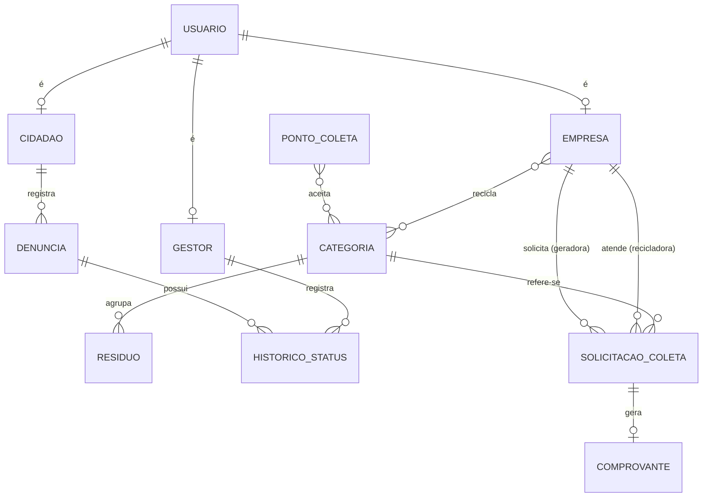

[⬅ Voltar ao índice](../README.md)

# Minimundo

O município deseja uma plataforma web para reduzir o descarte inadequado de resíduos sólidos urbanos e combater a desinformação sobre separação e reciclagem. A plataforma envolve três perfis de usuários: **cidadãos**, **empresas** e **gestores públicos**. Todo usuário se cadastra informando nome, e-mail, senha e telefone. O cidadão informa também o CPF e o bairro onde mora. A empresa informa CNPJ, razão social, endereço e o seu tipo, que pode ser **geradora** (comércios que produzem resíduos) ou **recicladora** (cooperativas e empresas de reciclagem). O gestor público é cadastrado apenas por outro gestor e informa a matrícula e o órgão em que trabalha.

Os resíduos são organizados em **categorias** (papel, plástico, vidro, metal, orgânico, eletrônico, perigoso e não reciclável). Cada **resíduo** possui um nome, uma lista de sinônimos usados na busca, uma categoria, a cor da lixeira correspondente, as instruções de preparo para o descarte (por exemplo, lavar, secar ou separar a tampa) e a indicação se é reciclável ou não. Um resíduo pertence a apenas uma categoria, e uma categoria pode conter vários resíduos.

Os **pontos de coleta** representam ecopontos, pontos de entrega voluntária e sedes de cooperativas. Cada ponto possui nome, tipo, endereço, latitude, longitude, horário de funcionamento e telefone de contato. Um ponto de coleta aceita uma ou mais categorias de resíduos, e uma categoria pode ser aceita por vários pontos. Apenas gestores podem cadastrar, alterar ou desativar pontos de coleta. Qualquer visitante, mesmo sem cadastro, pode consultar os resíduos e os pontos de coleta.

O cidadão pode registrar **denúncias** de descarte irregular. Cada denúncia possui descrição, foto obrigatória (JPG ou PNG de até 5 MB), latitude, longitude, bairro, data e hora de registro e um número de **protocolo** único gerado automaticamente. Toda denúncia inicia com o status **Aberta** e pode passar para **Em análise**, depois para **Resolvida** ou **Arquivada**. Somente gestores alteram o status, e cada alteração registra o gestor responsável, a data e uma observação, formando o histórico da denúncia. Qualquer pessoa pode consultar o andamento de uma denúncia pelo protocolo, mas os dados pessoais do denunciante não são exibidos publicamente.

Na **logística reversa B2B**, uma empresa geradora cria **solicitações de coleta** informando a categoria do material, o volume estimado em quilogramas, o endereço de retirada e a data desejada. Uma solicitação se refere a uma única categoria de material. As empresas recicladoras informam as categorias que aceitam e visualizam apenas as solicitações compatíveis. Ao aceitar uma solicitação, a recicladora fica vinculada a ela, e o status muda de **Pendente** para **Aceita**. Após a retirada, a recicladora registra o peso real coletado, e o status passa para **Coletada**. Quando a recicladora confirma o recebimento do material, a solicitação é **Concluída** e o sistema emite um **comprovante de destinação** com código de verificação, contendo os dados das duas empresas, o material, o peso e a data. Uma solicitação pendente pode ser cancelada pela empresa geradora.

O **painel de impacto** consolida os dados da plataforma por período: total de quilogramas destinados por categoria de material (a partir das coletas concluídas), quantidade de denúncias por status e por bairro, número de coletas realizadas e estimativa de CO₂ evitado, calculada com um fator de emissão cadastrado para cada categoria. A versão pública do painel exibe apenas dados agregados. O gestor acessa a versão completa, com filtros por período e por bairro.

---

[⬅ Anterior: Product Design](3_product-design.md) | [⬅ Voltar ao índice](../README.md) | [Próximo: Metodologia ➡](5_metodologia.md)
